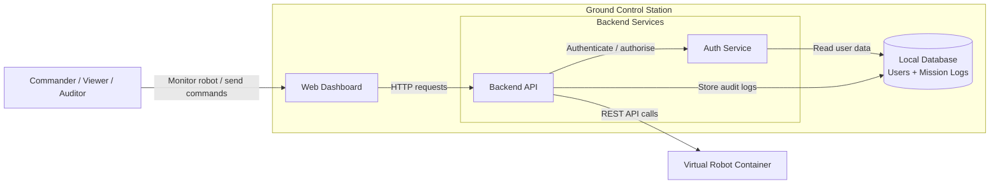

# Architecture – Robot Management System

## Architectural Pattern

The Ground Control Station follows a layered client–server architecture.

At the top layer, the Web Dashboard acts as the user interface through which operators monitor the robot and issue commands. This layer represents the presentation layer of the system.

The backend API acts as the controller and business logic layer. It processes HTTP requests, performs authentication and validation, communicates with the Virtual Robot API, and coordinates audit logging.

The persistence and external integration layer contains the local database for mission logs and the Virtual Robot container, which exposes the REST API used to retrieve telemetry and send commands.

This separation of concerns improves maintainability, testability, and scalability because individual layers can be updated without redesigning the whole system.

## Architecture Diagram

