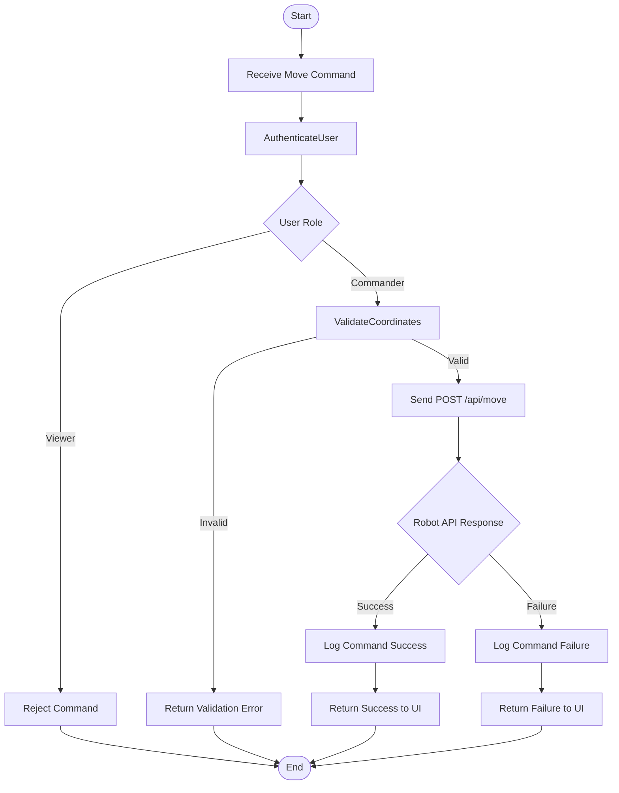

# Activity Diagram – Robot Move Command

```mermaid
flowchart TD

Start([Start])
Start --> ReceiveRequest[Receive Move Command]

ReceiveRequest --> AuthenticateUser
AuthenticateUser --> CheckRole{User Role}

CheckRole -->|Viewer| Reject[Reject Command]
CheckRole -->|Commander| ValidateCoordinates

ValidateCoordinates -->|Invalid| ValidationError[Return Validation Error]

ValidateCoordinates -->|Valid| SendCommand[Send POST /api/move]

SendCommand --> CheckAPI{Robot API Response}

CheckAPI -->|Success| LogSuccess[Log Command Success]
CheckAPI -->|Failure| LogError[Log Command Failure]

LogSuccess --> ReturnSuccess[Return Success to UI]
LogError --> ReturnFailure[Return Failure to UI]

Reject --> End([End])
ValidationError --> End
ReturnSuccess --> End
ReturnFailure --> End
```