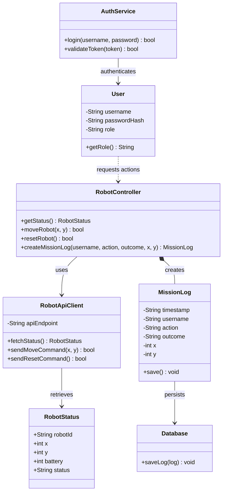

# Class Diagram – Robot Management System Backend

```mermaid
classDiagram

class User {
  -String username
  -String passwordHash
  -String role
  +getRole() String
}

class AuthService {
  +login(username, password) bool
  +validateToken(token) bool
}

class RobotController {
  +getStatus() RobotStatus
  +moveRobot(x, y) bool
  +resetRobot() bool
  +createMissionLog(username, action, outcome, x, y) MissionLog
}

class RobotApiClient {
  -String apiEndpoint
  +fetchStatus() RobotStatus
  +sendMoveCommand(x, y) bool
  +sendResetCommand() bool
}

class RobotStatus {
  +String robotId
  +int x
  +int y
  +int battery
  +String status
}

class MissionLog {
  -String timestamp
  -String username
  -String action
  -String outcome
  -int x
  -int y
  +save() void
}

class Database {
  +saveLog(log) void
}

AuthService --> User : authenticates
User ..> RobotController : requests actions
RobotController --> RobotApiClient : uses
RobotApiClient --> RobotStatus : retrieves
RobotController *-- MissionLog : creates
MissionLog --> Database : persists
```