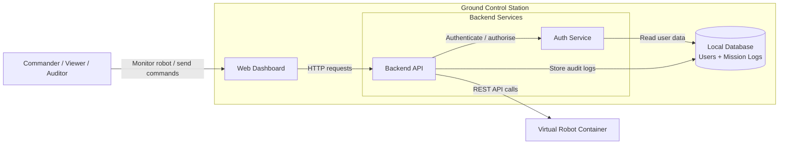

# Component Diagram – Robot Management System Architecture

```mermaid
flowchart LR

User[Commander / Viewer / Auditor]

subgraph GCS[Ground Control Station]
    UI[Web Dashboard]
    
    subgraph Backend[Backend Services]
        API[Backend API]
        AUTH[Auth Service]
    end

    DB[(Local Database\nUsers + Mission Logs)]
end

Robot[Virtual Robot Container]

User -->|Monitor robot / send commands| UI
UI -->|HTTP requests| API
API -->|Authenticate / authorise| AUTH
AUTH -->|Read user data| DB
API -->|Store audit logs| DB
API -->|REST API calls| Robot
```