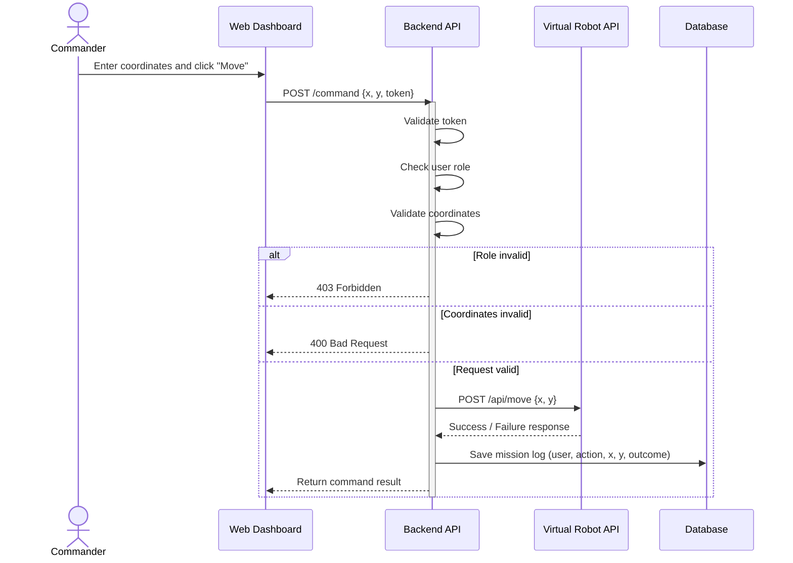

# Sequence Diagram – Move Robot Command

```mermaid
sequenceDiagram

actor Commander
participant UI as Web Dashboard
participant API as Backend API
participant Robot as Virtual Robot API
participant DB as Database

Commander->>UI: Enter coordinates and click "Move"
UI->>API: POST /command {x, y, token}

activate API

API->>API: Validate token
API->>API: Check user role
API->>API: Validate coordinates

alt Role invalid
    API-->>UI: 403 Forbidden
else Coordinates invalid
    API-->>UI: 400 Bad Request
else Request valid
    API->>Robot: POST /api/move {x, y}
    Robot-->>API: Success / Failure response
    API->>DB: Save mission log (user, action, x, y, outcome)
    API-->>UI: Return command result
end

deactivate API
```