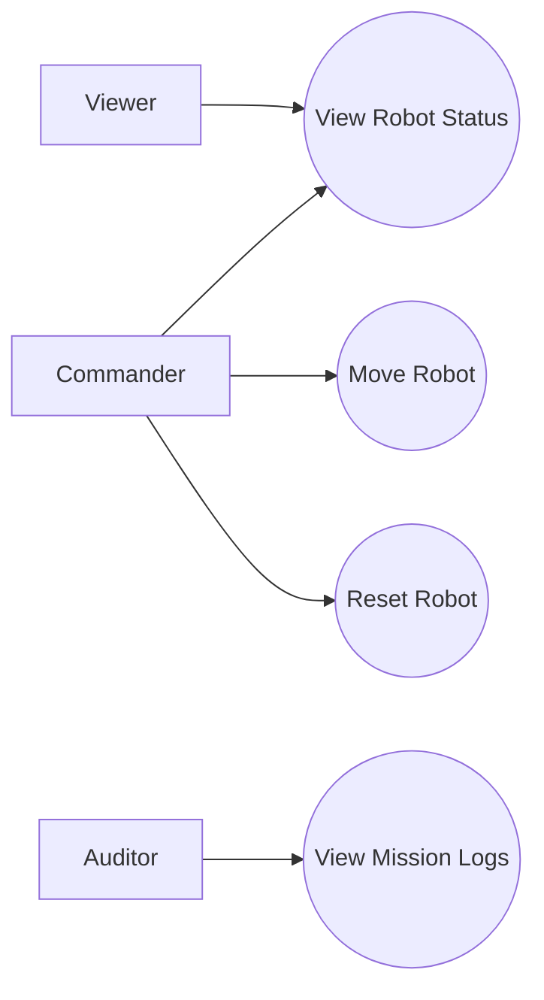

```mermaid
flowchart LR

%% Actors
Commander[Commander]
Viewer[Viewer]
Auditor[Auditor]

%% Use Cases
ViewStatus((View Robot Status))
MoveRobot((Move Robot))
ResetRobot((Reset Robot))
ViewLogs((View Mission Logs))

%% Relationships
Commander --> ViewStatus
Commander --> MoveRobot
Commander --> ResetRobot

Viewer --> ViewStatus

Auditor --> ViewLogs
```